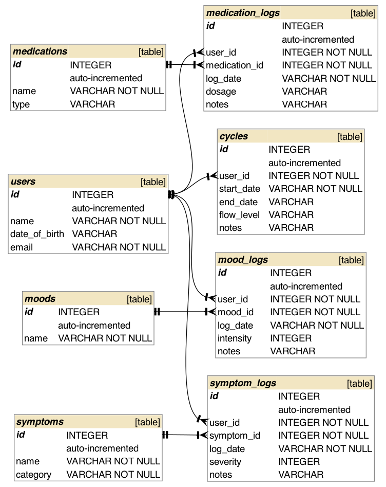

# Herra: Women's Health Symptom Tracker - Text-to-SQL

### Database Schema


Herra is a women's health tracking database that stores data about menstrual cycles, symptoms, moods, and medications. Users can ask natural language questions about their health data, and the system translates them into SQL queries using GPT-4o, then provides a friendly, empathetic response with insights.

## Prompting Strategies

The system uses a **zero-shot** approach — the full database schema is included in the system prompt, and questions are sent directly with no example SQL pairs. GPT is instructed to return only raw SQL with no markdown or explanation.

I also tried a **few-shot** approach by including 2-3 example question/SQL pairs in the system prompt. The few-shot strategy produced slightly more accurate queries for complex questions (like date arithmetic or multi-join queries), but for straightforward questions the zero-shot approach worked just as well. The few-shot approach was noticeably better at handling SQLite-specific functions like `JULIANDAY()` since it could learn the syntax from the examples.

## Sample Questions

### Correct Response
Strategy: zero-shot<br/>
Model: gpt-4o

Question:<br/>
What is the average cycle length for each user?

Generated SQL:
```sqlite
SELECT user_id, AVG(JULIANDAY(end_date) - JULIANDAY(start_date)) AS average_cycle_length
FROM cycles
WHERE end_date IS NOT NULL
GROUP BY user_id;
```

Query Results:<br/>
Columns: ['user_id', 'average_cycle_length']<br/>
(1, 4.2)<br/>
(2, 3.8333333333333335)<br/>
(3, 5.25)

Herra says:<br/>
Hello there! Let's take a look at the average cycle lengths for each user based on the data you provided:

- **User 1** has an average cycle length of about **4.2 days**.
- **User 2** experiences a cycle around **3.8 days**.
- **User 3** sees an average cycle of approximately **5.25 days**.

These numbers represent the average length of the cycles recorded. It's interesting to see how cycle lengths can vary from person to person, and even for the same person over time.

If these average lengths seem different from what you were expecting, or if they are considerably shorter than the typical menstrual cycle (which usually ranges from 21 to 35 days), it might be worth discussing with your healthcare provider to ensure everything is well. They can provide guidance tailored to your unique situation.

Remember, every body is different, and having accurate records can really help in understanding your body's patterns better. If you have any more questions or need further clarity, feel free to ask. Take care!

### Incorrect Response
This query returned no results because the SQL that was generated was just matching on the first name, when it needed to do the full name. I added that into the prompt later and got a successful response.

Strategy: zero-shot<br/>
Model: gpt-4o

Question:<br/>
What mood does Lena most often feel the day before her period starts?

Generated SQL:
```sqlite
SELECT m.name, COUNT(*) AS frequency
FROM mood_logs ml
JOIN moods m ON ml.mood_id = m.id
JOIN cycles c ON ml.user_id = c.user_id
JOIN users u ON ml.user_id = u.id
WHERE u.name = 'Lena' AND ml.log_date = DATE(c.start_date, '-1 day')
GROUP BY m.name
ORDER BY frequency DESC
LIMIT 1;
```

Query Results:<br/>
Columns: ['name', 'frequency']<br/>
*(no rows returned)*

Herra says:<br/>
Hi there! It looks like we didn't find any specific mood data for Lena the day before her period starts. This could mean a couple of things: Lena might not have logged her mood on those specific days, or there might be a gap in the data we have.

Tracking moods consistently can be really helpful in spotting patterns or changes over time, especially around your menstrual cycle. If Lena wants to see more insights in the future, she might consider logging her mood daily or more frequently, especially as her period approaches.

If Lena has noticed any particular mood changes or patterns that concern her, it could be beneficial to discuss them with a healthcare professional. They can provide guidance and support tailored to her individual needs. If you have any more questions or need further assistance, feel free to reach out!

### More Examples

#### Example 1
Strategy: zero-shot<br/>
Model: gpt-4o

Question:<br/>
What are Maria's most common symptoms during her period?

Generated SQL:
```sqlite
  SELECT s.name, COUNT(sl.id) AS frequency
FROM symptom_logs sl
JOIN symptoms s ON sl.symptom_id = s.id
JOIN users u ON sl.user_id = u.id
JOIN cycles c ON sl.user_id = c.user_id AND sl.log_date BETWEEN c.start_date AND c.end_date
WHERE u.name LIKE 'Maria%'
GROUP BY s.name
ORDER BY frequency DESC;
```

Query Results:<br/>
  Columns: ['name', 'frequency']
  ('Cramps', 4)
  ('Fatigue', 4)
  ('Back pain', 3)
  ('Headache', 2)
  ('Nausea', 1)
  
Herra says:<br/>
  Hello there! It looks like we've got some insights into Maria's most common symptoms during her period. Here's what the data reveals:

- **Cramps** and **Fatigue** are the most frequently logged symptoms, both occurring 4 times. This suggests that these might be the most bothersome or noticeable symptoms for Maria during her period.
- **Back pain** follows closely, with 3 occurrences, indicating it's also a significant symptom for her.
- **Headache** and **Nausea** were logged less frequently, with 2 and 1 occurrences respectively, but they still contribute to how Maria experiences her period.

It seems like Maria experiences a mix of physical discomforts, which is quite common during periods. If these symptoms are particularly bothersome, it might be a good idea for Maria to discuss them with her healthcare provider. They can offer advice on how to manage these symptoms effectively.

Remember, everyone's experience is unique, and tracking symptoms can be a great way to highlight patterns and help in managing them better. If Maria continues to log her symptoms, over time, she might notice other patterns or triggers that can be addressed. 

Take care, and feel free to reach out if you have more questions or need further assistance!

#### Example 2
Strategy: zero-shot<br/>
Model: gpt-4o

Question:<br/>
Which user has the highest average cramp severity?

Generated SQL:
```sqlite
  SELECT u.name
FROM users u
JOIN symptom_logs sl ON u.id = sl.user_id
JOIN symptoms s ON sl.symptom_id = s.id
WHERE LOWER(s.name) = LOWER('Cramps')
GROUP BY u.id
ORDER BY AVG(sl.severity) DESC
LIMIT 1;
```

Query Results:<br/>
  Columns: ['name']
  ('Maria Santos',)
Herra says:<br/>
  Hi there! It looks like Maria Santos has the highest average cramp severity among users. This means that out of everyone using the app, Maria has been experiencing more intense cramps on average.

If you’re Maria or if you know her, it might be worthwhile to pay attention to patterns around when the cramps occur. Are they linked to specific times in the menstrual cycle, certain foods, or stress levels? Keeping a detailed symptom log can be very helpful.

If the cramps are moderate to severe, it could be a good idea to discuss this with a healthcare provider. They can help explore possible underlying causes and provide options for relief or management.

Remember, you're not alone, and there's support available to help you manage how you're feeling. Let me know if there's anything else you’d like to know! 😊

#### Example 3
Strategy: zero-shot<br/>
Model: gpt-4o

Question:<br/>
How many times has Priya taken ibuprofen, and what was the highest dose?

Generated SQL:
```sqlite
  SELECT COUNT(ml.id) AS times_taken, MAX(ml.dosage) AS highest_dose
FROM medication_logs ml
JOIN users u ON ml.user_id = u.id
JOIN medications m ON ml.medication_id = m.id
WHERE LOWER(m.name) = LOWER('ibuprofen') AND u.name LIKE 'Priya%';
```

Query Results:<br/>
  Columns: ['times_taken', 'highest_dose']
  (6, '800mg')
Herra says:<br/>
  Hi Priya! 😊

I looked into your question about the times you've taken ibuprofen and the highest dose you've had. Here's what I found:

- You've taken ibuprofen **6 times**.
- The highest dose you've recorded is **800mg**.

It’s great that you’re keeping track of your medication. This can be super helpful for understanding how certain doses might affect you. Remember, while ibuprofen can help with pain or inflammation, it’s always good to stick to the recommended guidelines unless advised otherwise by a healthcare professional.

If you find yourself needing to take it frequently or in higher doses, it might be worth discussing this with your doctor. They can offer guidance tailored to your needs and help ensure you're managing your symptoms in the best way possible. 😊

If you have more questions or need further help, feel free to reach out. Take care! 🌼
#### Example 4
Strategy: zero-shot<br/>
Model: gpt-4o

Question:<br/>
Show me all symptoms Priya logged with severity 7 or higher

Generated SQL:
```sqlite
  SELECT s.name, sl.severity, sl.log_date
FROM symptom_logs sl
JOIN users u ON sl.user_id = u.id
JOIN symptoms s ON sl.symptom_id = s.id
WHERE u.name LIKE 'Priya%' AND sl.severity >= 7;
```

Query Results:<br/>
  Columns: ['name', 'severity', 'log_date']
  ('Cramps', 8, '2025-10-10')
  ('Cramps', 7, '2025-10-11')
  ('Fatigue', 7, '2025-10-10')
  ('Back pain', 8, '2025-10-11')
  ('Cramps', 9, '2025-11-11')
  ('Fatigue', 8, '2025-11-11')
  ('Back pain', 7, '2025-11-12')
  ('Mood swings', 7, '2025-11-10')
  ('Cramps', 8, '2026-01-14')
  ('Cramps', 7, '2026-01-15')
  ('Fatigue', 7, '2026-01-14')
  ('Back pain', 8, '2026-01-15')
Herra says:<br/>
  Hi Priya! I took a look at the symptoms you've logged with a severity of 7 or higher. Here's a little summary for you:

- **Cramps** seem to be a recurring issue, with quite high severity scores. You've logged them several times, peaking at a severity of 9 on November 11, 2025.
- **Fatigue** also appears consistently, with scores of 7 and 8, which suggests it's been quite bothersome for you.
- **Back pain** has been logged a few times too, with severity reaching up to 8.
- You noted **mood swings** with a severity of 7 on November 10, 2025.

It seems like these symptoms, particularly cramps and fatigue, are quite intense at times. If you find that they're impacting your daily life, it might be worth discussing them with your doctor. They can help you explore potential underlying causes or treatment options to manage these symptoms better.

Remember, you're doing great by keeping track of your symptoms, and this information is valuable in managing your health. If you have more questions or need further insights, feel free to reach out! 😊
#### Example 5
Strategy: zero-shot<br/>
Model: gpt-4o

Question:<br/>
<!-- TODO: add a question -->

Generated SQL:
```sqlite
-- TODO: paste generated SQL here
```

Query Results:<br/>
<!-- TODO: paste results here -->

Herra says:<br/>
<!-- TODO: paste response here -->

#### Example 6
Strategy: zero-shot<br/>
Model: gpt-4o

Question:<br/>
<!-- TODO: add a question -->

Generated SQL:
```sqlite
-- TODO: paste generated SQL here
```

Query Results:<br/>
<!-- TODO: paste results here -->

Herra says:<br/>
<!-- TODO: paste response here -->
